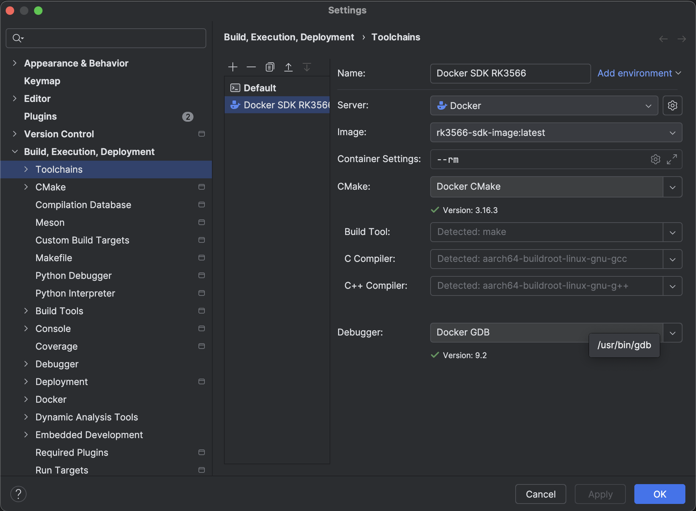
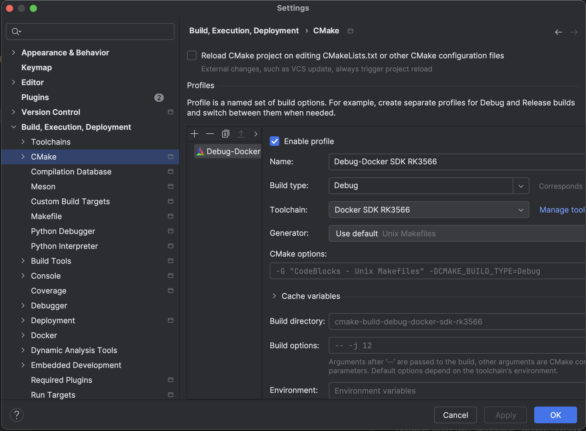
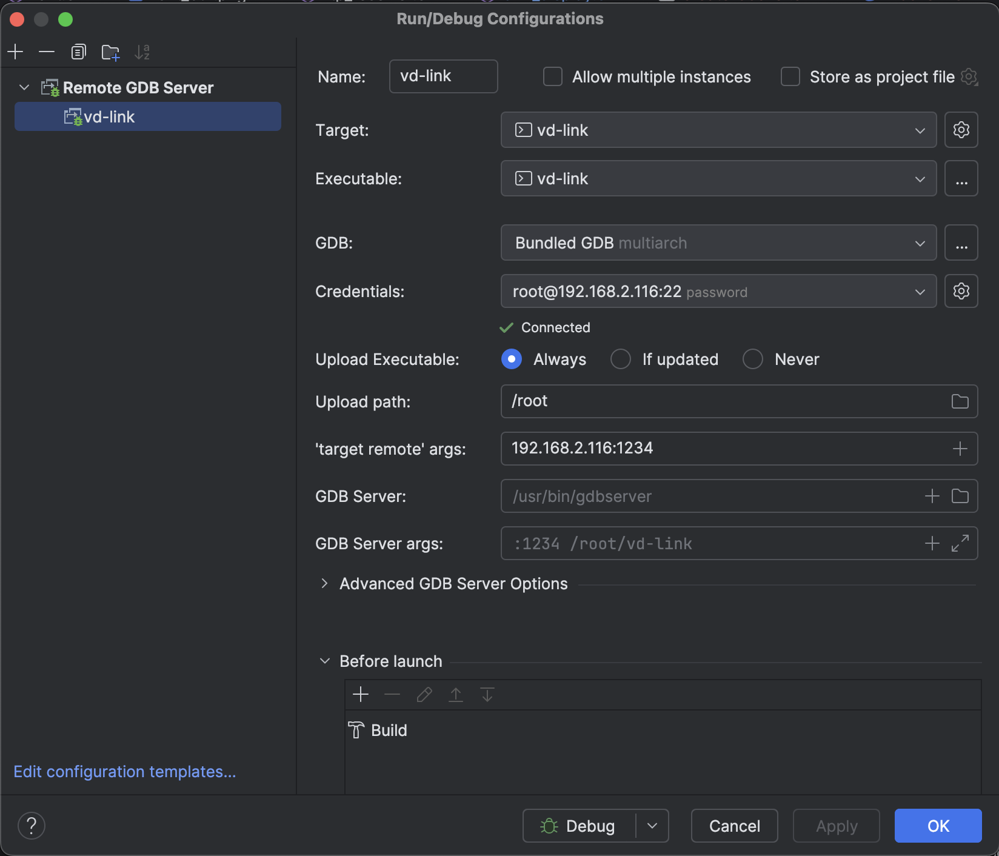
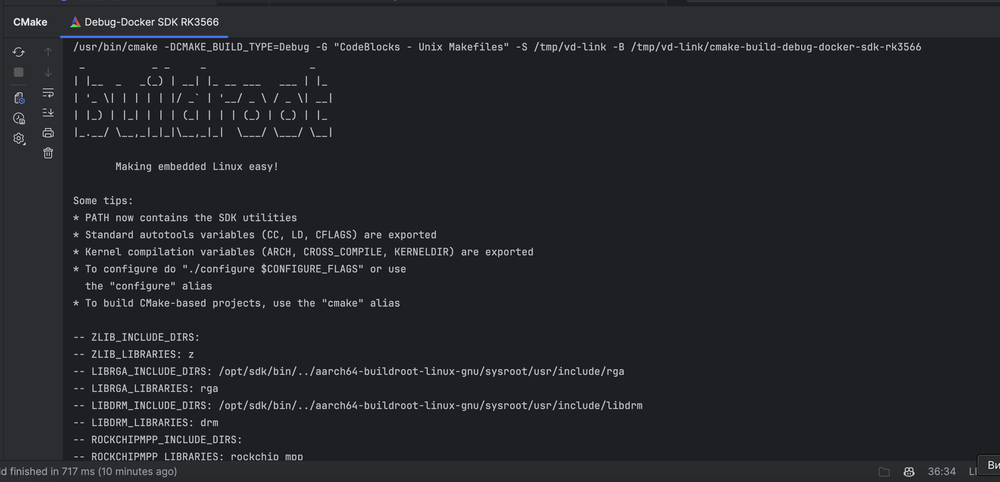

# RK3566 SDK Docker Environment

This repository provides a clean Docker-based development environment for **RK3566** using a **Buildroot SDK** (`aarch64-buildroot-linux-gnu_sdk-buildroot`). It supports usage both via command-line and through **CLion Docker Toolchain** integration.

---

## 📥 Prerequisites

1. Download the SDK archive: [aarch64-buildroot-linux-gnu_sdk-buildroot.tar.gz](https://gitlab.hard-tech.org.ua/-/project/54/uploads/e61180e057be710362a4255e997cd603/aarch64-buildroot-linux-gnu_sdk-buildroot.tar.gz)
2. Extract it into the same directory as the `Dockerfile`:

```bash
tar -xf aarch64-buildroot-linux-gnu_sdk-buildroot.tar.gz
```
You should now have:
```bash
./aarch64-buildroot-linux-gnu_sdk-buildroot/
./Dockerfile
./create-docker.sh
```

## 🐳 Build & Run with create-docker.sh

Use the helper script to build the image, create a container, and optionally run commands inside.

Run without arguments

```bash
./create-docker.sh
```
`These will execute the command inside the container, then stop and remove it afterward.`

## CLion Integration

You can use this image in CLion via Docker Toolchain:
•	Image name: rk3566-sdk-image
•	Container mount path: /workspace
•	Working directory: /workspace
•	Environment setup: handled automatically via /entry.sh inside the image









## Cleanup
To manually remove everything:

```bash
docker rm -f rk3566-sdk-container
docker rmi rk3566-sdk-image
```

