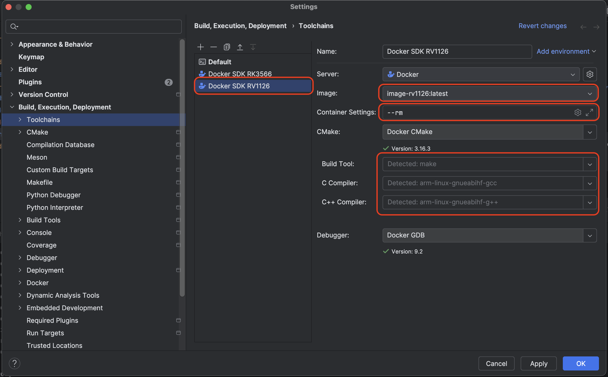

# RV1126 & RK3566 SDK Docker Environment

This repository provides a clean Docker-based development environment for **RK3566** & **RV1126** using a **Buildroot SDK.** It supports usage both via command-line and through **CLion Docker Toolchain** integration.

---

## 📥 Prerequisites

1. Download the SDK archive for RK3566: [aarch64-buildroot-linux-gnu_sdk-buildroot.tar.gz](https://gitlab.hard-tech.org.ua/-/project/54/uploads/e61180e057be710362a4255e997cd603/aarch64-buildroot-linux-gnu_sdk-buildroot.tar.gz)
2. Download the SDK archive for RV1126: [vision-sdk.tar.gz](https://gitlab.hard-tech.org.ua/-/project/2/uploads/2a38fb33f9dc972ef00b15b8155399ef/vision-sdk.tar.gz)
3. Extract it into the same directory as the `Dockerfile.*`:

```bash
tar -xf aarch64-buildroot-linux-gnu_sdk-buildroot.tar.gz
tar -xf vision-sdk.tar.gz
```
You should now have:
```bash
./aarch64-buildroot-linux-gnu_sdk-buildroot/
./vision-sdk/
./Dockerfile.rk3566
./Dockerfile.rv1126
./docker.sh
```

## 🐳 Build & Run with create-docker.sh

Use the helper script to build the image, create a container, and optionally run commands inside.

Run with arguments: ```rk3566` or `rv1126` to specify the target platform.

```bash
./docker.sh rv1126
# or
./docker.sh rk3566
```
`These will execute the command inside the container, then stop and remove it afterward.`

## CLion Integration

You can use this image in CLion via Docker Toolchain:
•	Image name: image-rk3566 or image-rv1126
•	Container mount path: /workspace
•	Working directory: /workspace
•	Environment setup: handled automatically via /entry.sh inside the image

### CLion Settings RK3566


### CLion Settings RV1126



### Run/Debug Configuration via remote GDB Server


## Cleanup
To manually remove everything:

```bash
docker rm -f container-rk3566
docker rmi image-rk3566

docker rm -f container-rv1126
docker rmi image-rv1126
```

